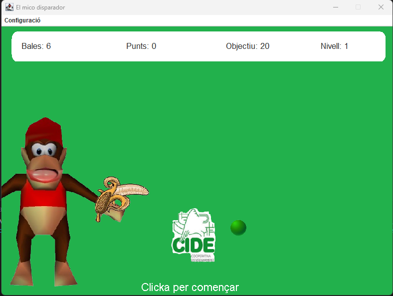

# Cowboy-Shooter-Game
Un joc de trets en 2D de 8 bits creat amb l'API i fils de treball de Java Swing.

# Screenshots

# Game Instructions 
* Fes clic per disparar una bala.
* Cada cop dóna **10** punts i colpejar la pilota al centre suma **20** punts.
* Recompensa de **Bala extra** per 2 cops consecutius.
* En arribar a la puntuació objectiu, el nivell canvia.